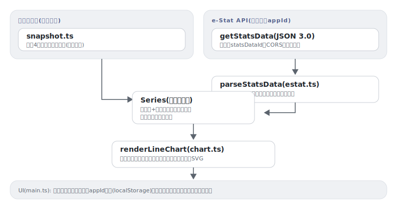

# toukei

[](https://github.com/miruky/toukei/actions/workflows/ci.yml)
[](https://github.com/miruky/toukei/actions/workflows/deploy.yml)
[](https://www.typescriptlang.org/)
[](LICENSE)

**日本の主要統計を一覧しつつ、e-Stat APIで任意の統計表をその場で可視化する静的ダッシュボード**

デモ: https://miruky.github.io/toukei/

## 概要

toukeiは、政府統計の総合窓口(e-Stat)を入口にした統計ダッシュボードである。画面上段には総人口・出生数・完全失業率・消費者物価指数の4指標を、最新値・前回比・推移チャート・期間の最小／平均／最大付きのカードで表示する。この部分は公表値を丸めた概数のスナップショットを同梱しているため、APIキーなしで誰でもすぐ動く。

下段がライブ取得で、e-Stat APIの利用登録で得たappIdと統計表ID(statsDataId)を入れると、`getStatsData` をブラウザから直接呼び、レスポンスを系列に整形して折れ線チャートと凡例で描画する。e-Stat APIはCORSを許可しているため中間サーバーは不要で、appIdは利用者のブラウザのlocalStorageにだけ保存される。

e-StatのJSONには、要素が1件のとき配列にならない、秘匿値が `***` で入る、分類コードをCLASS_INFで名前に解決する必要がある、といった癖がある。`parseStatsData` がそれらを吸収して「系列名+時系列の点」という素朴なモデルへ正規化し、同梱スナップショットも同じモデルに乗せて、チャート描画を一本化している。

### なぜ作ったのか

e-Statは日本の統計の宝庫だが、サイト上でグラフを見るまでの手数が多く、APIのレスポンスも素直に扱える形ではない。「正規化するパーサ+汎用の折れ線描画」を一度書いてしまえば、統計表IDを差し替えるだけで何でも眺められる。APIキーを配布物に埋め込まず、かつキーがない人にも空のページを見せない、という制約を「概数スナップショットの同梱+利用者自身のappId」という構成で解いた。

## アーキテクチャ



## 技術スタック

| カテゴリ             | 技術                                        |
| :------------------- | :------------------------------------------ |
| 言語                 | TypeScript 5(strict、実行時依存ゼロ)        |
| データ源             | e-Stat API 3.0(getStatsData)+ 同梱概数      |
| ビルド               | Vite 8                                      |
| テスト               | Vitest 4(node環境、API仕様準拠のフィクスチャ) |
| リンタ・フォーマッタ | ESLint(typescript-eslint)+ Prettier         |
| CI / 配信            | GitHub Actions / GitHub Pages               |

## 使い方

### e-Statのレスポンスを系列へ整形する

```ts
import { statsDataUrl, parseStatsData } from './lib';

const url = statsDataUrl(myAppId, '0003448237', { limit: 500 });
const table = parseStatsData(await (await fetch(url)).json());

table.title; // => 統計表の表題
table.unit; // => 千人 など
table.series[0];
// => { label: '男 / 全国', points: [{ time: '2020年', order: '2020000000', value: 61350 }, ...] }
```

時間軸(`@time`)を横軸に、それ以外の分類(`@cat01` や `@area`)の名前の組み合わせを系列名にする。秘匿値(`***`)は点として採用しない。APIがエラーを返したときは `ERROR_MSG` の文言で例外になる。

### チャートを描く

```ts
import { renderLineChart } from './lib';

document.getElementById('chart')!.innerHTML = renderLineChart(table.series, table.unit);
```

複数系列の塗り分け、軸目盛りの自動選択、時点が多いときのx軸ラベルの間引きを行う。出力はviewBox指定のSVG文字列で、DOMなしでテストできる。

### 同梱スナップショット

```ts
import { snapshotDatasets } from './lib';

snapshotDatasets.map((d) => d.name);
// => ['総人口', '出生数', '完全失業率', '消費者物価指数(総合)']
```

各データセットには出典と「概数」であることが明記されている。統計の正確な複製ではない。

## プロジェクト構成

- `src/lib/estat.ts` e-Stat APIのURL組み立てとレスポンスの正規化
- `src/lib/snapshot.ts` キー不要で表示する主要4指標の概数時系列
- `src/lib/chart.ts` 複数系列対応の折れ線チャートSVG生成
- `src/lib/format.ts` 値・前回比・要約統計(最小／平均／最大)の表記とHTMLエスケープ
- `src/main.ts` 指標カード・ライブ取得フォームのUI配線
- `docs/` アーキテクチャ図

## はじめ方

### 前提条件

- Node.js 22以上
- ライブ取得を使う場合は [e-Stat APIの利用登録](https://www.e-stat.go.jp/api/) で得るappId

### セットアップ

```bash
git clone https://github.com/miruky/toukei.git
cd toukei
npm ci
npm run dev
```

### テスト・lint・ビルド

```bash
npm test
npm run lint
npm run build
```

テストはネットワークに出ない。getStatsData(3.0)の公開仕様に沿ったフィクスチャでパーサを、合成系列でチャートを検証する。

### デプロイ

mainへのpushで `deploy.yml` がGitHub Pagesへ公開する。サブパス配信のためのbaseは環境変数 `TOUKEI_BASE` で渡す。

## 制約

- 同梱スナップショットは公表値を丸めた概数で、更新も手動。正確な値はライブ取得か元統計を参照すること。
- ライブ取得の描画は先頭6系列まで。cdCat01などによる絞り込みUIは持たない(URLパラメータとしてAPIには渡せる)。
- statsDataIdの検索(getStatsList)は実装していない。表IDはe-Statのサイトで調べる前提。

## 設計方針

- **APIキーを配布物に入れない** — appIdは利用者が自分で取得し、ブラウザのlocalStorageにだけ残す。鍵なしでも価値があるよう、概数スナップショットの指標カードを同梱する。
- **2系統を同じモデルに合流させる** — スナップショットもライブ取得も「系列名+時系列の点」へ正規化し、チャート・整形のコードを共有する。
- **レスポンスの癖はパーサに閉じ込める** — 単要素の非配列化・秘匿値・分類名の解決といったe-Stat特有の事情は `parseStatsData` だけが知っている。
- **概数は概数と言う** — 画面とREADMEの両方でスナップショットが概数であることと出典を明示する。

## ライセンス

[MIT](LICENSE)
